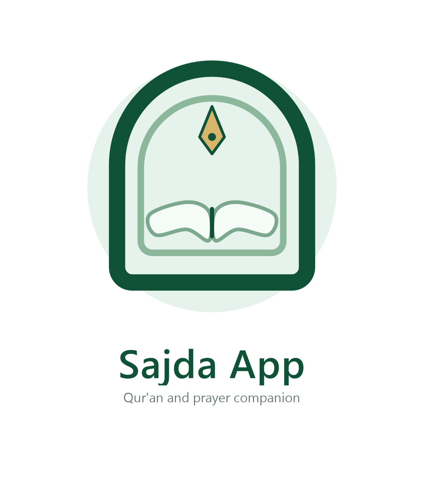
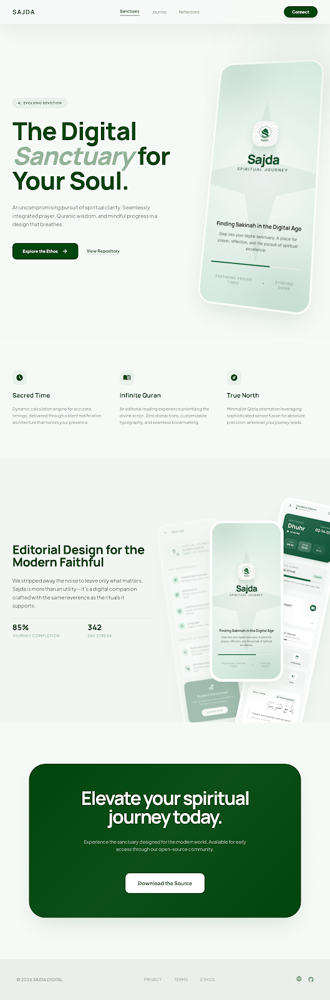

<p align="center">
  
</p>

<h1 align="center">Sajda App</h1>

<p align="center">
  A modern Islamic Android app for Qur'an reading, prayer times, adhan reminders, and daily spiritual engagement.
</p>

<p align="center">
  
  
  
  
</p>

<p align="center">
  <a href="https://github.com/saferill/Sajda-App/releases/tag/v1.1.1">
    
  </a>
  <a href="https://github.com/saferill/Sajda-App/releases/download/v1.1.1/Sajda-App-v1.1.1.apk">
    
  </a>
</p>

## About

Sajda App is a native Android application built with Kotlin and Jetpack Compose for a calm, focused, and personal daily worship experience. The project follows an `offline-first` approach so core flows such as Qur'an reading, bookmarks, and prayer schedule access remain fast and reliable.

Sajda App brings several important worship features into one consistent experience:

- Full Qur'an reading
- Per-surah murattal audio
- Prayer times and adhan system
- Qibla and location settings
- Bookmarks, progress tracking, and daily engagement

## Why Sajda App

- Designed for a clean and peaceful worship experience
- Gives users control instead of forcing heavy system behavior
- Saves storage by downloading audio per surah
- Built with a modern interface that feels soft and premium
- Structured to grow into a mature real-world daily worship app

## Key Features

### Qur'an Experience

- Full offline Qur'an
- Arabic text, translation, and transliteration
- Last read and auto resume
- Focus mode
- Surah and ayah search
- Ayah bookmarks
- Bookmark folders
- Highlight colors
- Personal notes for each ayah
- Reading controls for Arabic font size, translation size, and verse spacing

### Prayer Experience

- Daily prayer times
- Weekly schedule foundation
- Next prayer indicator
- Adhan settings and per-prayer toggle
- Manual adhan test
- Adhan snooze
- Qibla screen
- GPS and manual city selection
- Prayer calculation method and Asr madhhab selection

### Audio Experience

- Per-surah audio download
- Offline playback
- Persistent mini player
- Full player screen
- Background playback
- Delete downloaded files

## Picture


<p align="center">
  
</p>

## Latest Release

- Release page: [Sajda App v1.1.1](https://github.com/saferill/Sajda-App/releases/tag/v1.1.1)
- Direct APK: [Sajda-App-v1.1.1.apk](https://github.com/saferill/Sajda-App/releases/download/v1.1.1/Sajda-App-v1.1.1.apk)
- Changelog: [CHANGELOG.md](CHANGELOG.md)

## Tech Stack

| Layer | Stack |
|---|---|
| Language | Kotlin |
| UI | Jetpack Compose + Material 3 |
| Architecture | MVVM + Repository Pattern |
| Local Data | Room |
| Preferences | DataStore |
| Reactive State | Flow / StateFlow |
| Audio | Media3 / ExoPlayer |
| Background Work | Foreground Service, AlarmManager, WorkManager |

## Project Structure

```text
app/src/main/
|- java/com/sajda/app/
|  |- data/
|  |  |- local/
|  |  `- repository/
|  |- domain/model/
|  |- service/
|  |- ui/
|  |  |- component/
|  |  |- screen/
|  |  |- theme/
|  |  `- viewmodel/
|  |- util/
|  |- widget/
|  `- MainActivity.kt
|- assets/
|- res/
`- AndroidManifest.xml
```

## Getting Started

### Requirements

- Android Studio
- Android SDK
- JDK
- Gradle support for Android builds

### Build Release APK

```bash
./gradlew assembleRelease
```

Output:

```text
app/build/outputs/apk/release/Sajda-App-v1.1.1.apk
```

## App Permissions

| Permission | Purpose |
|---|---|
| `ACCESS_FINE_LOCATION` | Automatic location for prayer times and qibla |
| `ACCESS_COARSE_LOCATION` | Fallback location access |
| `POST_NOTIFICATIONS` | Adhan and reminder notifications |
| `FOREGROUND_SERVICE` | Audio and adhan services |
| `FOREGROUND_SERVICE_MEDIA_PLAYBACK` | Background media playback |
| `SCHEDULE_EXACT_ALARM` | Exact prayer alarms |
| `REQUEST_IGNORE_BATTERY_OPTIMIZATIONS` | Better reminder reliability |
| `RECEIVE_BOOT_COMPLETED` | Reschedule alarms after reboot |

## Development Status

This project is still in active development. The main foundation is already strong, but several areas are still being refined to make the app more reliable across different Android devices.

Current focus areas:

- Adhan reliability across devices
- UI/UX consistency and finishing
- Release verification and GitHub distribution
- Continued improvement of Qur'an, audio, and prayer workflows

## Roadmap

- Improve adhan and reminder reliability
- Add deeper Qur'an and spiritual content
- Refine qibla, location, and prayer calculation flows
- Prepare a more stable release build
- Expand hadith and dua content sources
- Improve documentation for public development

## Contributing

Contribution guidelines are available in [CONTRIBUTING.md](CONTRIBUTING.md).

Good areas to contribute:

- UI polish
- Bug fixing
- Prayer and adhan reliability
- Qur'an reading experience
- Documentation and project cleanup

## License

This repository does not currently include a final license. Before publishing the project publicly, it is a good idea to choose a license that matches how you want the project to be used.

## Notes

- This project follows an offline-first approach
- Audio is not bundled all at once in order to save storage
